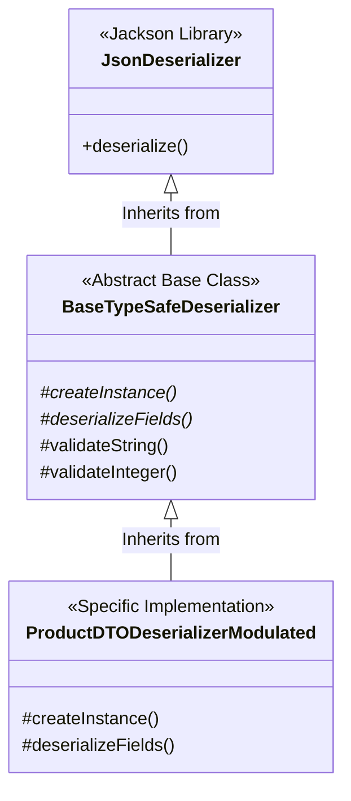
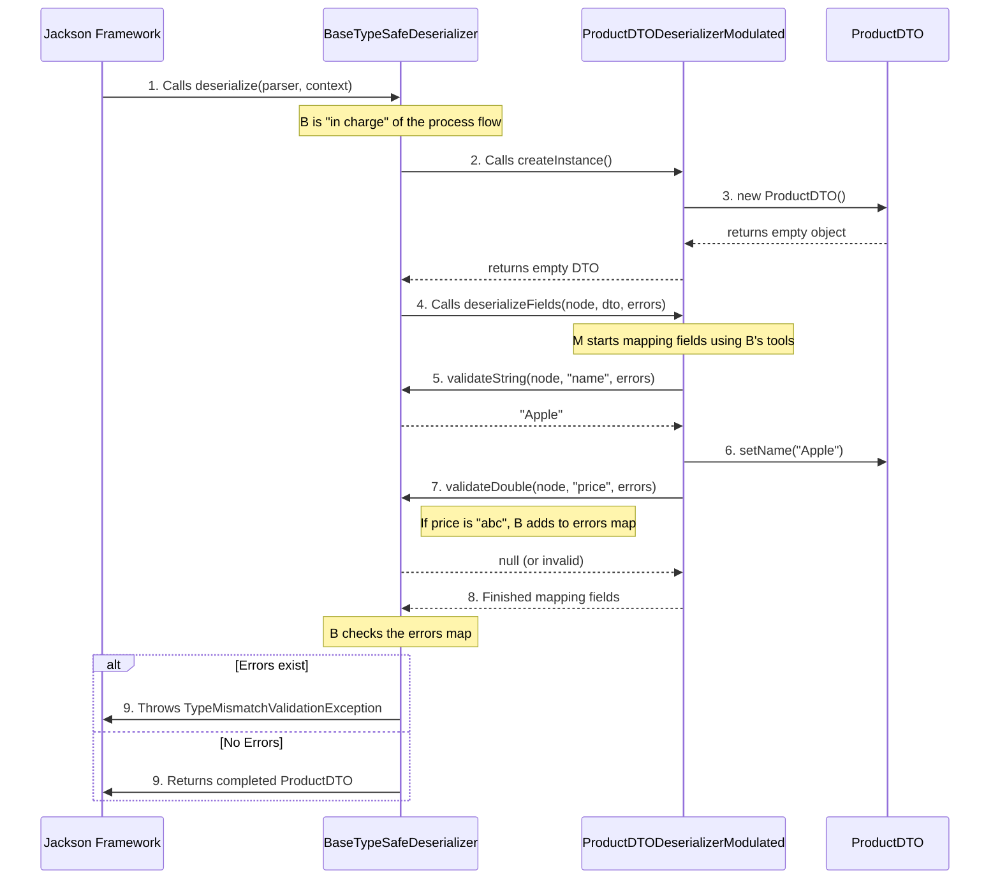

# The Deserialization "Dance": Flow and Structure

To understand how these classes work together, think of it as a **team project** where everyone has a specific role.

---

## 1. The Hierarchy (Inheritance)

This is a "Top-Down" relationship. Each level adds more specialized knowledge.

1.  **Jackson (`JsonDeserializer`)**: The "Boss" who knows how to talk to the internet but doesn't know what a "Product" is.
2.  **Base Class (`BaseTypeSafeDeserializer`)**: The "Manager" who knows the general rules (how to validate a string, how to collect errors) but doesn't know which fields a specific DTO has.
3.  **Modulated Class (`ProductDTODeserializerModulated`)**: The "Specialist" who knows exactly what a Product looks like (it has a name, price, and category).

---

## 2. The Execution Flow (Sequence)

When a request arrives, here is the exact order of who calls whom. This uses the **Template Method Pattern**.

---

## 3. Key Concepts for Beginners

### "The Hook" (Abstract Methods)
In `BaseTypeSafeDeserializer.java`, you see methods marked `protected abstract`. 
*   **The Base Class says**: "I know I need to create an instance and map fields, but I don't know *how* to do it for your specific object."
*   **The Child Class says**: "Don't worry, I'll provide those specific details (the 'how')."

### The Helpers (Protected Methods)
Methods like `validateString` are `protected` so the Child class can use them. 
*   The child class (`ProductDTODeserializerModulated`) **calls up** to the parent (`BaseTypeSafeDeserializer`) to perform the boring validation work.
*   This keeps the child class very small and focused only on naming the fields.

### The Lifecycle Management
The Parent class is the only one that handles the `try/catch` logic and the `if (!errors.isEmpty())` check. This ensures that **every single DTO in your project** behaves exactly the same way when it fails. If you want to change how errors are reported, you only have to change it in **one file** (the Base Class).
